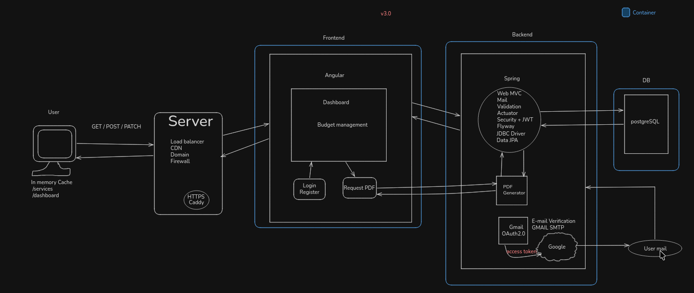
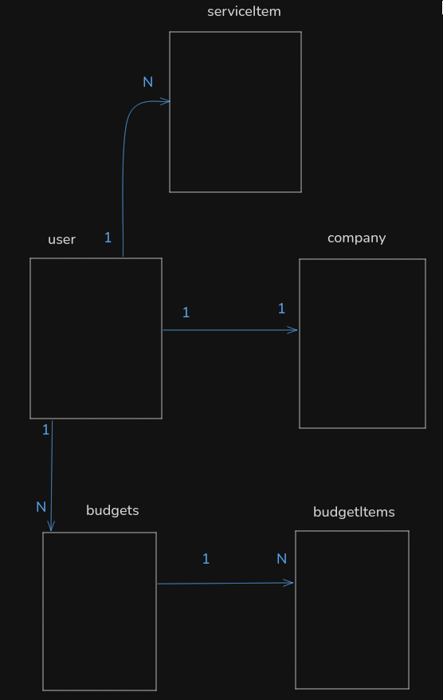

# Service Budget Manager
Manage your budgets: Create, Delete, Edit and Generate PDF of your budgets.

A register/login, configure company data, manage reusable service items, create budgets, edit saved budgets, delete saved budgets, and download it as PDF.

------------------

#### Project flow diagram



```
Login -> Dashboard -> CompanyProfile -> CreateBudget -> FillClientData -> AddItems -> ApplyDiscount -> Generate PDF.
```

#### Entities



```
  User      (1 -> 1) Company
  User      (1 -> N) Budgets
  User      (1 -> N) ServiceItem
  User      (1 -> N) EmailVerificationToken
  User      (1 -> N) AuditLog

  Budgets    (1 -> N) BudgetItem
  BudgetItem (N -> 1) Budgets
```
------------------

#### Routes

``
Auth Routes:
  POST   /api/auth/register
  POST   /api/auth/verify-email
  POST   /api/auth/resend-verification
  POST   /api/auth/login
  GET    /api/auth/me
  POST   /api/auth/change-password
  POST   /api/auth/logout

Auth response:
  - Login/change-password retornam dados do usuário no body:
    { "name": "...", "email": "..." }
  - O JWT enviado em cookie HttpOnly `authToken`.

Budget Routes:
  GET    /api/budgets?page=0&size=20
  POST   /api/budgets
  GET    /api/budgets/{id}
  PUT    /api/budgets/{id}
  PATCH  /api/budgets/{id}/status
  DELETE /api/budgets/{id}
  GET    /api/budgets/{id}/pdf

Service Catalog Routes:
  GET    /api/services?page=0&size=20
  POST   /api/services
  PUT    /api/services/{id}
  DELETE /api/services/{id}

Company Routes:
  GET    /api/company
  PUT    /api/company
  POST   /api/company/logo
  GET    /api/company/logo
  DELETE /api/company/logo

Health Route:
  GET    /actuator/health
```

------------------

#### Stack

Angular
  - @OpenPDF 1.3.39
  
Spring
- Web MVC
- Mail
- Validation
- Actuator
- Security + JWT
- Flyway
- JDBC Driver
- Data JPA
  
PostgreSQL 18

------------------

#### Requirements

- Java 17+
- Maven
- Node.js
- Docker with Compose plugin
- PostgreSQL container

------------------

#### Structure

```
pages/home
pages/login
pages/register
pages/verify-email
pages/dashboard
pages/account
pages/company
pages/services
pages/budget-form
pages/budget-view    

services/auth
services/budget
services/company
services/service-item
```
-------------------

###### TODOS
Company profile,
Handle NFS-e,
Mobile app,
Play Store Version,


