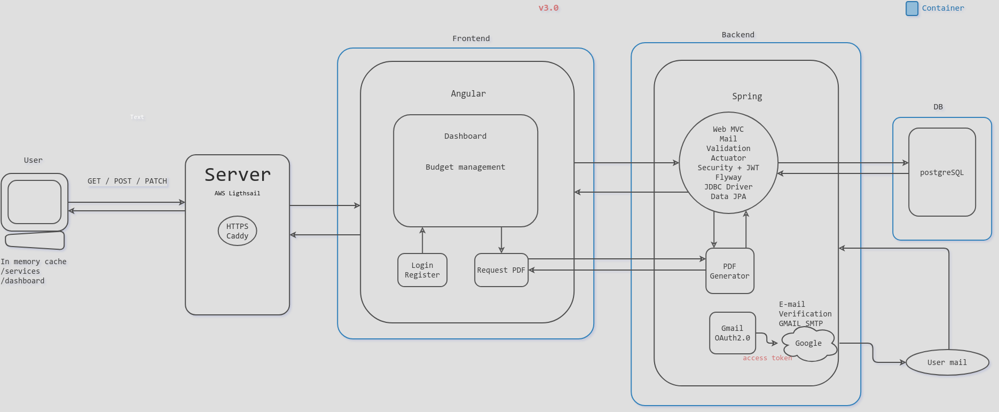
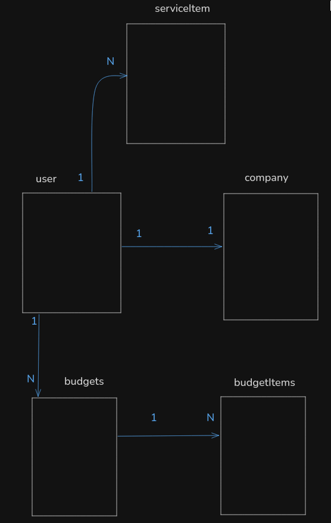

# Service Budget Manager
Manage your budgets: Create, Delete, Edit and Generate PDF of your budgets.

A register/login, configure company data, manage reusable service items, create budgets, edit saved budgets, delete saved budgets, and download it as PDF.

------------------

# Goal
Project goal:
``` 
    Make a web platform, that have users, and let the same users:
        1. Manage their company profiles (name, address, logo),
        2. Define predefined "Services" or products that the user company disposes.
        3. Create, manage and download as PDF budgets of services you're planning to send to clients, informing: client information, services to be done, discount (from 0% to 100%), and further observations.
```
Learning goal:

```
Understand more about Full-stack web engineering:
    Auto SSL certificate generation and Reverse proxy with Caddy, 
    Authentication with OAuth2.0 + Google APIs and JWT + user memory cache,
    System deploying (AWS),
    Create and integrate REST APIs,
    Frontend UI and UX design,
    Use of a production-grade frontend framework: Angular,
    Learn deeper concepts of Java and SpringBoot such as how internal tools work,
    Manage and use SpringBoot dependencies,
    System security and prevention such as implementing DTOs, rate limiting by IP and e-mail,
    Integration of an opensource system to generate PDF,
    Unit, Integration, Validation tests, 
    Model and maintain a PostgreSQL database with real data,
    Environment and configuration handling,
    OpenAPI Specifications with Swagger.

Things learn and improve:
    Enhanced Log system,
    Observability using Terraform and Grafana,
    Message broker with RabbitMQ.
    
```
# Divide and conquer thought process

```
Backend:
    1. Think about and model the system flow.
    2. Think about and model the Database entities relationships.
    3. Implement all the models created as code.
    4. Wrap the project in a docker container.

Database: 
    1. Create the PostgreSQL database following the modeled entities and relationships.
    2. Wrap the database in a docker container.

Frontend:
    1. Think about and model the UI/UX design
        Why Angular is a good framework for this project?
        A: For the user perspective, it's better to navigate in a system that deliver pages instantly.
        A2: Wanted put in practice the use of a good, enterprise-grade frontend framework.
    2. Study a viable project structure in Angular.
    3. Implement the UI following the defined structure.
    4. Integrate the frontend with the backend APIs.
    5. Wrap the frontend in a docker container.

HTTPS certificate server with Caddy.

Project containers are composed with docker compose.


```

---------------

#### Project flow diagram



```
Login -> Dashboard -> CompanyProfile -> CreateBudget -> FillClientData -> AddItems -> ApplyDiscount -> Generate PDF.
```

#### Entities



```
  User      (1 -> 1) Company
  User      (1 -> N) Budgets
  User      (1 -> N) ServiceItem
  User      (1 -> N) EmailVerificationToken
  User      (1 -> N) AuditLog

  Budgets    (1 -> N) BudgetItem
  BudgetItem (N -> 1) Budgets
```
------------------

#### Routes

```
Auth Routes:
  POST   /api/auth/register
  POST   /api/auth/verify-email
  POST   /api/auth/resend-verification
  POST   /api/auth/login
  GET    /api/auth/me
  POST   /api/auth/change-password
  POST   /api/auth/logout
```
```
Auth response:
  - Login/change-password retornam dados do usuário no body:
    { "name": "...", "email": "..." }
  - O JWT enviado em cookie HttpOnly `authToken`.
```
```
Budget Routes:
  GET    /api/budgets?page=0&size=20
  POST   /api/budgets
  GET    /api/budgets/{id}
  PUT    /api/budgets/{id}
  PATCH  /api/budgets/{id}/status
  DELETE /api/budgets/{id}
  GET    /api/budgets/{id}/pdf
```
```
Service Catalog Routes:
  GET    /api/services?page=0&size=20
  POST   /api/services
  PUT    /api/services/{id}
  DELETE /api/services/{id}

```
```
Company Routes:
  GET    /api/company
  PUT    /api/company
  POST   /api/company/logo
  GET    /api/company/logo
  DELETE /api/company/logo
```

```
Health Route:
  GET    /actuator/health
```

------------------

#### Stack

Angular 21
  
  
Spring Boot 4.0.6
- Web MVC
- Mail
- Validation
- Actuator
- Security + JWT
- Flyway
- JDBC Driver
- Data JPA
  
@OpenPDF 1.3.39

PostgreSQL 16

------------------

#### Requirements

- Java 21
- Maven
- Node.js 20.19^
- Docker with Compose plugin
- PostgreSQL container
  
------------------

#### Structure

```
pages/home
pages/login
pages/register
pages/verify-email
pages/dashboard
pages/account
pages/company
pages/services
pages/budget-form
pages/budget-view    

services/auth
services/budget
services/company
services/service-item
```
-------------------

###### TODOS
Handle Brazil NFS-e,
Port to mobile,


